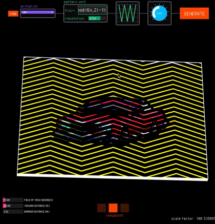

# FabObscura

**Computational Design and Fabrication for Interactive Barrier-Grid Animations**  
Published at **ACM UIST 2025**

[Project Page →](https://hcie.csail.mit.edu/research/fabobscura/fabobscura.html)


<p align="center">
  
  
  
</p>


## Overview

**FabObscura** introduces a computational system for designing and fabricating *interactive barrier-grid animations*. It extends beyond traditional straight-line barriers to support curved, radial, and multi-directional patterns. FabObscura supports sliding, rotational, and view-dependent barrier-grid animations.

This repository contains:
- `fabobscura_server.py` — the Python server that generates barrier-grid patterns and composites.
- A **Processing** front-end for authoring, parameter tuning, and visualization.

---

## Installation

### 1. Clone the repository
```bash
git clone https://github.com/<yourusername>/FabObscura.git
cd FabObscura
```

### 2. Python dependencies
Ensure you are using **Python 3.8+** and install the required packages:

```bash
pip install numpy opencv-python imutils matplotlib pillow sympy flask
```

### 3. Processing dependencies
The Processing code requires the following libraries:
- [**ControlP5**](https://sojamo.de/libraries/controlP5/)
- [**Grafica**](https://jagracar.com/grafica.php)

You can install them via *Processing → Sketch → Import Library → Add Library...*

---

## Running the System

### Step 1 — Start the Python Server
Run the Flask backend:
```bash
python fabobscura_server.py
```

By default, it runs on `http://127.0.0.1:3000/`.

### Step 2 — Run the Processing Interface
After starting the server, open the Processing sketch (e.g., `fabobscura_ui.pde`) and run it.  
The Processing interface communicates with the Python server to generate barrier patterns and animations.

---

## Using Your Own Animation Files

To use your own animation sequence:

1. Export your animation as **individual image frames** (e.g., PNG or JPG).  
2. Place all frames for one animation into a **single folder** inside `fabobscura_ui/data/`.  
3. Each folder should contain only the frames for a single animation.  
4. You can refer to the existing folders in `fabobscura_ui/data/` as examples.

The system will automatically read and interlace all images in the selected folder to generate the barrier-grid composite.

---

## Citation

If you use this software or build upon this work, please cite:

> **Ticha Sethapakdi**, Maxine Perroni-Scharf, Mingming Li, Jiaji Li, Justin Solomon, Arvind Satyanarayan, and Stefanie Mueller.  
> *FabObscura: Computational Design and Fabrication for Interactive Barrier-Grid Animations.*  
> In Proceedings of the **ACM Symposium on User Interface Software and Technology (UIST ’25)**. ACM, 2025.

```bibtex
@inproceedings{sethapakdi2025fabobscura,
  title={FabObscura: Computational Design and Fabrication for Interactive Barrier-Grid Animations},
  author={Sethapakdi, Ticha and Perroni-Scharf, Maxine and Li, Mingming and Li, Jiaji and Solomon, Justin and Satyanarayan, Arvind and Mueller, Stefanie},
  booktitle={Proceedings of the ACM Symposium on User Interface Software and Technology (UIST ’25)},
  year={2025},
  publisher={ACM}
}
```

